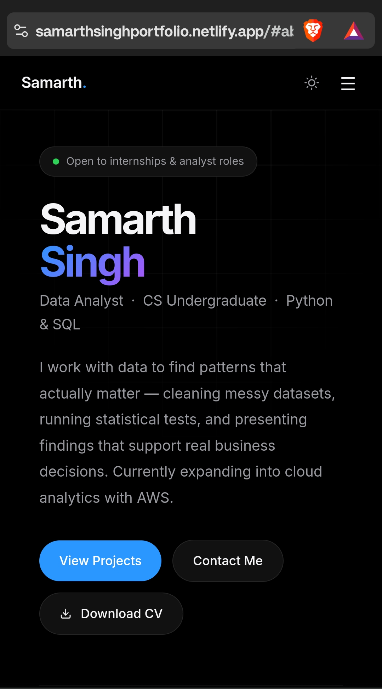

# Personal Portfolio Website

A modern portfolio website built to showcase my Data Analytics projects, technical skills, and professional experience.

## About

This portfolio serves as a central hub for my analytics work, including projects focused on:

- A/B Testing & Conversion Optimization
- Customer Segmentation using RFM Analysis
- E-Commerce Sales Analytics
- Customer Churn Analysis
- Data Visualization & Business Insights

The website also provides access to my resume, GitHub repositories, and professional profiles.

## Tech Stack

- HTML5
- CSS3
- JavaScript
- Responsive Design
- Git & GitHub
- Netlify (Deployment)

## Features

- Responsive design for desktop and mobile devices
- Interactive project showcase
- Resume download functionality
- Direct links to GitHub repositories
- Professional experience and skills section
- Contact and social profile integration

## Live Portfolio

Portfolio: https://samarthsinghportfolio.netlify.app/

Contact

LinkedIn: https://www.linkedin.com/in/samarth-singh-official

Email: OfficialSamarthsingh@gmail.com

Author

Samarth Singh

Aspiring Data Analyst focused on transforming data into actionable business insights through analytics, visualization, and statistical methods.
